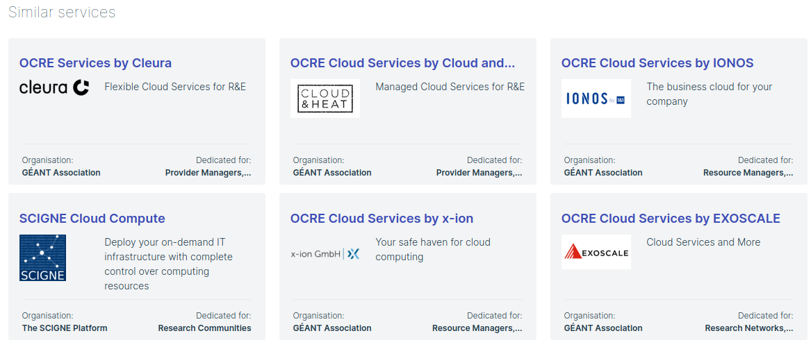

# Licence

<! --- SPDX-License-Identifier: CC-BY-4.0  -- >

## Introduction

The Content-Based RS has the goal of generating recommendations of similar services that a user of the marketplace is currently viewing.

The recommendations take into account:

- the text attributes of the service (i.e. tagline, description)
- the metadata attributes of the service (i.e. scientific domains, categories)
- the user history of orders of other services

The application is built as a microservice with a REST API that is deployed in the marketplace infrastructure (from Cyfronet).

**Note**: Recommendations are only generated for services, not for publications, datasets, etc.

## API

[Content-Based RS API](https://app.swaggerhub.com/apis-docs/MikeXydas/EOSC-ContentBasedRS/2.1.0)
