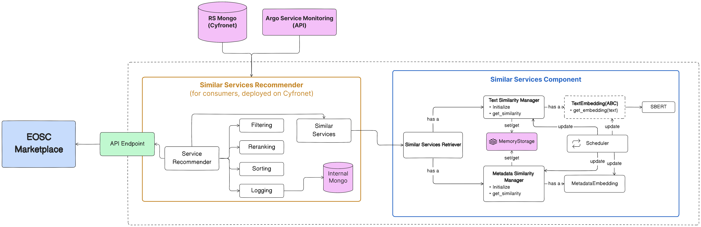

# Licence

<! --- SPDX-License-Identifier: CC-BY-4.0  -- >

## System Architecture

The system consists of 2 main components:

- **Similar services component**, responsible for calculating the similarity between the onboarding service and the rest of the services in the catalogue.
- **Similar Services Recommender**, responsible for providing the similar services functionality using the results of the previous component.

Concerning persistence the system uses:

- **RS Mongo** (external), which is used as a read-only database that provides access to the catalogue of services. This database is hosted on Cyfronet premises.
- **Argo Service Monitoring API** (external), which is used as a read-only API that provides access to the monitoring data of the services.
- **Internal Mongo**, which is used to store recommendations generated by the system.
- **Redis** (internal), which is used to store internal structures like embeddings and similarities.

## Similar Services Component

The similar services component consists of the following sub-components:

- `TextEmbedding`, responsible for generating the text embeddings using the `SBERT` model.
- `MetadataEmbedding`, responsible for generating the metadata embeddings using one-hot encoding.
- `TextSimilarityManager`, responsible for calculating the similarity between the onboarding service and the rest of the services in the catalogue.
- `MetadataSimilarityManager`, responsible for calculating the similarity between the onboarding service and the rest of the services in the catalogue.
- `SimilarServicesRetriever`, responsible for retrieving the most similar services to the onboarding service based on text attributes.
- `Scheduler`, responsible for scheduling the update of the internal structures of the model (embeddings, similarities).

## Similar Services Recommender

The similar services recommender consists of the following sub-components:

- `Filtering`, responsible for filtering out services (i.e. they are reported as not working from the monitoring API).
- `Reranking`, responsible for increasing the diversity of the recommendations.
- `Sorting`, responsible for deciding the order of the recommendations.
- `Logging`, responsible for logging the recommendations.
- `ServiceRecommender`, responsible for providing the similar services functionality using the results of the previous components.
- `API Endpoint`, responsible for providing the API endpoints (`fastapi`) for the similar services functionality.
